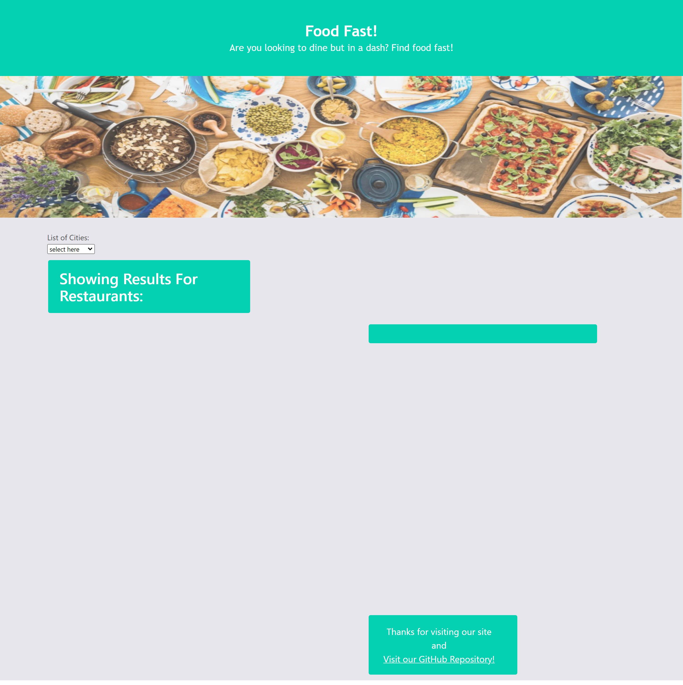

# Food Fast

## Description

We created a web application that functions as a restaurant locator. When you can't decide on a place to eat select a local Minnesota city to choose a restaurant out of the list and use the Google Maps feature for location details.

## Installation

N/A

## Usage 

This web application was created using JavaScript, jQuery, third-party APIs, and Bulma CSS framework.

- Click a city in the drop down
- Results will display for restaurants in that city
- Use the Google Maps for further details on location 

#### The work done can be found on the GitHub repository [zahirovic/Food-Fast](https://github.com/zahirovic/Food-Fast)
- The actual product can be found **[here](https://zahirovic.github.io/Food-Fast/)** and should look along the lines of this depending on device screen size:

## Credits
- [W3Schools on creating a search bar/button](https://www.w3schools.com/howto/howto_css_search_button.asp)
- [Worldwide Restaurants API](https://rapidapi.com/ptwebsolution/api/worldwide-restaurants)
- [Google Maps API](https://developers.google.com/maps/)
- [W3 Resources on adding a dropdown](https://www.w3resource.com/jquery-exercises/part1/jquery-practical-exercise-31.php)
- [MDNWedDocs on event.preventDefault](https://developer.mozilla.org/en-US/docs/Web/API/Event/preventDefault) 
- [jQuery](https://api.jquery.com/)
- [Bulma CSS Framework](https://bulma.io/)

## Features
- JavaScript
- Bulma CSS Framework
- Google Maps API
- Worldwide Restaurants API
- jQuery
